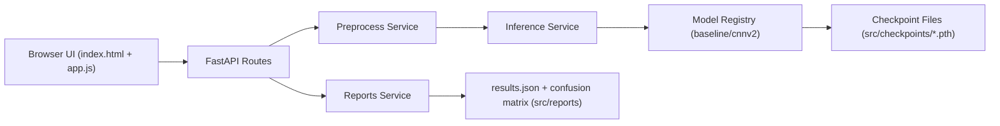

# CIFAR-10 PyTorch FastAPI Portfolio

Inference-first web interface for a CIFAR-10 CNN project using FastAPI, typed APIs, and a polished single-page demo UI.

## What I Built
- FastAPI service with startup checkpoint loading (`baseline` + `cnnv2`).
- API endpoints for health, model listing, prediction, and report artifacts.
- Editorial-style demo page with drag/drop upload and top-k prediction view.
- Structured request logging with request IDs and endpoint latency capture.
- Docker packaging and Render deploy configuration.

## Architecture


## Local Run (uv + FastAPI)
1. Install dependencies:
   ```bash
   uv sync
   ```
2. Start the web app:
   ```bash
   uv run uvicorn webapp.main:app --host 0.0.0.0 --port 8000 --reload
   ```
3. Open:
   - `http://localhost:8000/`
   - `http://localhost:8000/docs`

## Docker Run
1. Build:
   ```bash
   docker build -t cifar10-fastapi .
   ```
2. Run:
   ```bash
   docker run --rm -p 8000:8000 -e PORT=8000 cifar10-fastapi
   ```
3. Verify:
   - `http://localhost:8000/health`

## Docker Dev (Hot Reload)
1. Start development container:
   ```bash
   docker compose -f docker-compose.dev.yml up --build
   ```
2. Edit files in `webapp/` or `src/` and changes reload automatically in the running container.
3. Open:
   - `http://localhost:8000/`
   - `http://localhost:8000/docs`

## Deployment URL
- Add your Render production URL here after first deploy:
  - `https://<your-service>.onrender.com`

## Public API
| Method | Path | Purpose |
|---|---|---|
| GET | `/health` | service readiness and loaded models |
| GET | `/api/v1/models` | available model metadata |
| POST | `/api/v1/predict` | single-image prediction (multipart upload) |
| GET | `/api/v1/reports` | metrics + figure metadata for UI |
| GET | `/` | portfolio demo page |

## Notes on Artifacts
- Checkpoints expected at:
  - `src/checkpoints/best_baseline.pth`
  - `src/checkpoints/best_cnnv2.pth`
- Report artifacts expected at:
  - `src/reports/results.json`
  - `src/reports/confusion_matrix.svg`

## What I Optimized For
- Clean inference path and deterministic JSON output.
- Portfolio presentation quality without changing notebook training flow.
- CPU-only behavior for predictable Render runtime.

## Tradeoffs
- `cnnv2` currently uses the same exported architecture/checkpoint family as baseline in this repository snapshot.
- No retraining API in v1 (inference-only by design).
- In-memory latency counters are reset on process restart.

## Next Steps
1. Add GitHub Actions (UV sync check + Docker build).
2. Add lightweight rate limiting on `/api/v1/predict`.
3. Add batch prediction endpoint.
4. Connect experiment tracking (MLflow or W&B).

## Model Card
- See `docs/model-card.md`.
