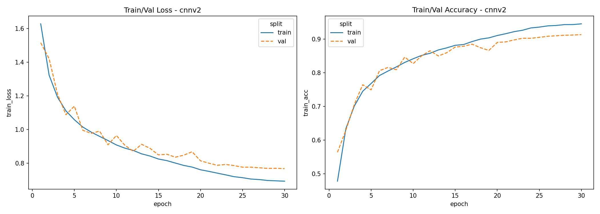
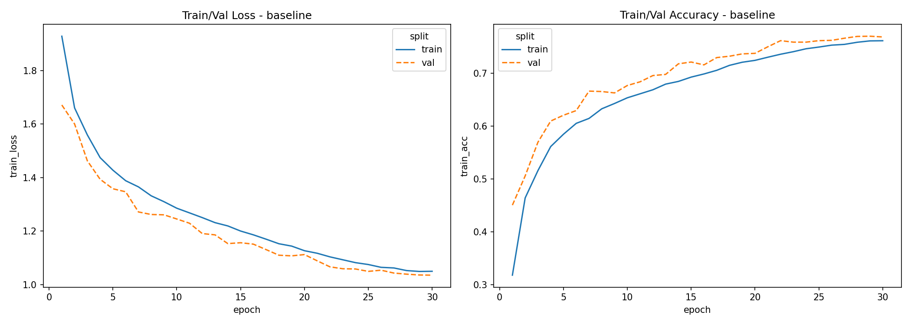
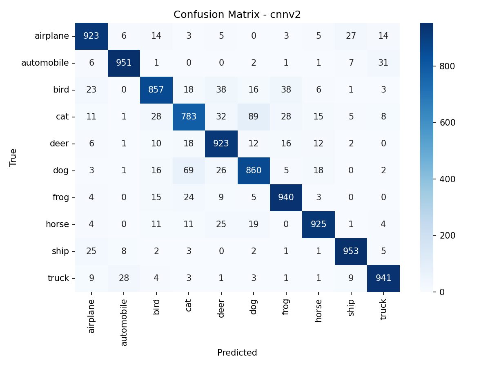
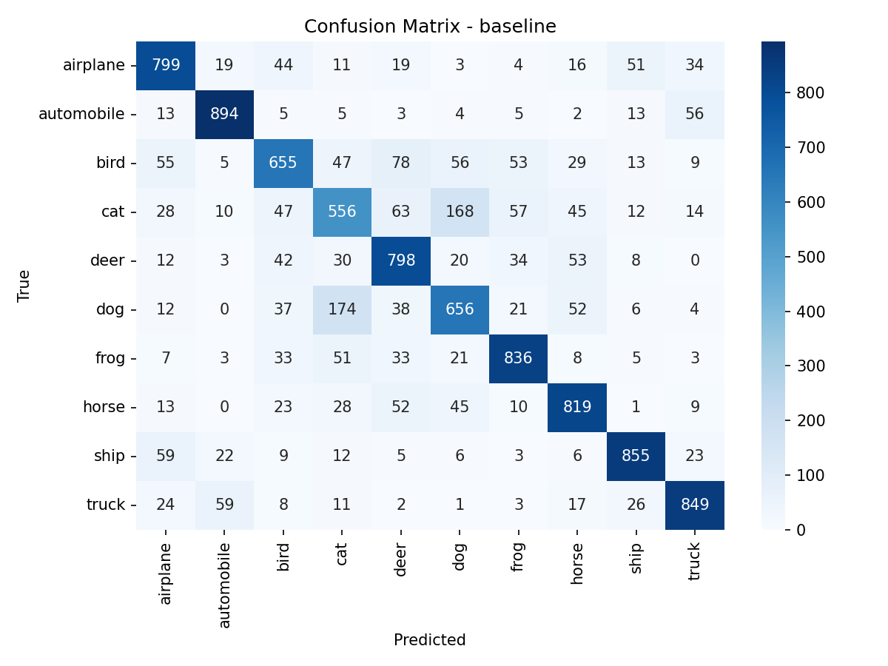

# CIFAR-10 PyTorch FastAPI Portfolio

Inference-first web interface for a CIFAR-10 CNN project using FastAPI and a PyTorch CNN model.

**Demo:** [https://cifar10-pytorch-production.up.railway.app/](https://cifar10-pytorch-production.up.railway.app/)

## Model Architecture
The production `cnnv2` model is a 3-stage convolutional network for CIFAR-10 (`32x32` RGB input) with batch normalization and progressively stronger dropout regularization.

| Stage      | Layers                                        | Output Shape      | Dropout |
| ---------- | --------------------------------------------- | ----------------- | ------- |
| Input      | RGB image                                     | `[B, 3, 32, 32]`  | -       |
| Stage 1    | `Conv(3->64) + BN + ReLU` x2, `MaxPool(2)`    | `[B, 64, 16, 16]` | `0.15`  |
| Stage 2    | `Conv(64->128) + BN + ReLU` x2, `MaxPool(2)`  | `[B, 128, 8, 8]`  | `0.20`  |
| Stage 3    | `Conv(128->256) + BN + ReLU` x2, `MaxPool(2)` | `[B, 256, 4, 4]`  | `0.30`  |
| Head       | `AdaptiveAvgPool2d(1)`, `Flatten`             | `[B, 256]`        | -       |
| Classifier | `Linear(256->10)`                             | `[B, 10]`         | -       |

### Tensor Shape Flow
`[B, 3, 32, 32] -> [B, 64, 16, 16] -> [B, 128, 8, 8] -> [B, 256, 4, 4] -> [B, 256, 1, 1] -> [B, 256] -> [B, 10]`

### Design Notes
- All convolutions use `3x3` kernels with `padding=1` to preserve spatial resolution inside each stage.
- Convolutions are created with `bias=False` because each is immediately followed by BatchNorm.
- Dropout increases by depth (`0.15 -> 0.20 -> 0.30`) to regularize higher-level features.
- The final layer outputs raw logits (no softmax in-model); post-processing (e.g., probabilities) is applied at inference time.

## Model Performance
Metrics below are from `src/reports/results.json` on the CIFAR-10 test set.

| Model      | Accuracy | Macro Precision | Macro Recall | Macro F1 |
| ---------- | -------- | --------------- | ------------ | -------- |
| `cnnv2`    | `90.56%` | `90.53%`        | `90.56%`     | `90.52%` |
| `baseline` | `77.17%` | `76.99%`        | `77.17%`     | `77.03%` |

### Training Curves
**CNNv2**


**Baseline**


### Confusion Matrices
**CNNv2**


**Baseline**



## Run Locally
1. Install dependencies:
   ```bash
   uv sync
   ```
2. Start the web app:
   ```bash
   uv run uvicorn webapp.main:app --host 0.0.0.0 --port 8000 --reload
   ```
3. Open:
   - `http://localhost:8000/`
   - `http://localhost:8000/docs`

## Docker Run
1. Build:
   ```bash
   docker build -t cifar10-fastapi .
   ```
2. Run:
   ```bash
   docker run --rm -p 8000:8000 -e PORT=8000 cifar10-fastapi
   ```
3. Verify:
   - `http://localhost:8000/health`

### Docker Build Notes
- The production image is optimized for Railway with a multi-stage Docker build.
- Runtime dependencies are split into:
  - `requirements.railway.txt` (FastAPI/runtime libs from PyPI)
  - `requirements.railway.torch.txt` (CPU-only `torch`/`torchvision` from the PyTorch CPU index)
- This avoids downloading CUDA packages in cloud builds and reduces image push/build overhead.
- Docker targets:
  - `runtime` target (default): slim image for Railway/prod.
  - `dev` target: adds `watchfiles` for better local hot reload UX.

## Docker Compose (Hot Reload)
1. Start development container:
   ```bash
   docker compose -f docker-compose.dev.yml up --build
   ```
   The compose file builds Docker `target: dev`, which enables `watchfiles`-based reloads for `*.py`, `*.html`, `*.css`, and `*.js`.
2. Edit files in `webapp/` or `src/` and changes reload automatically in the running container.
3. Open:
   - `http://localhost:8000/`
   - `http://localhost:8000/docs`

## Public API
| Method | Path              | Purpose                                    |
| ------ | ----------------- | ------------------------------------------ |
| GET    | `/health`         | service readiness and loaded models        |
| POST   | `/api/v1/predict` | single-image prediction (multipart upload) |
| GET    | `/api/v1/reports` | metrics + figure metadata for UI           |
| GET    | `/`               | demo page                                  |

## Notes on Artifacts
- Checkpoints expected at:
  - `src/checkpoints/best_baseline.pth`
  - `src/checkpoints/best_cnnv2.pth`
